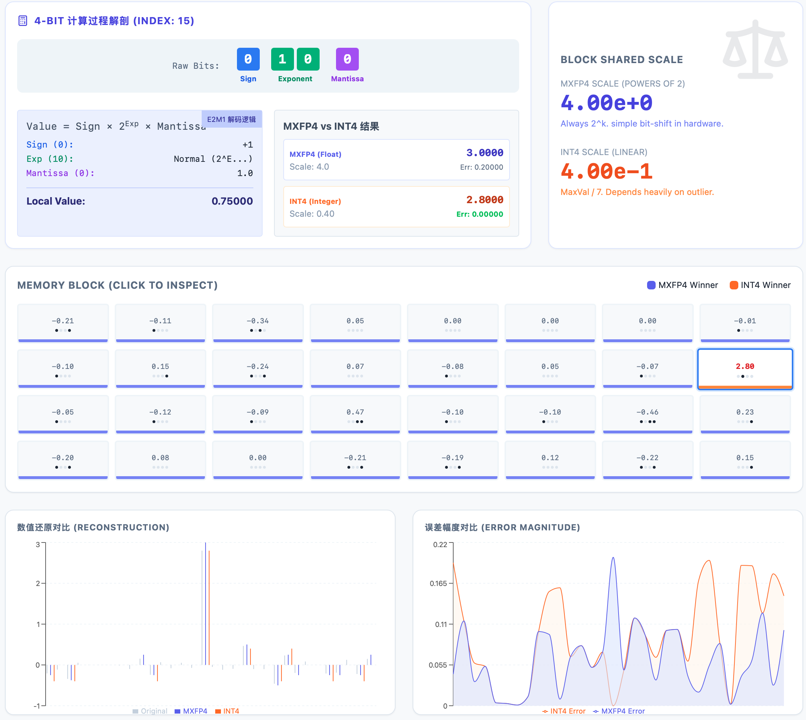

# MXFP4 数据格式可视化工具 (MXFP4 Visualizer)

这是一个基于 React 和 Vite 构建的交互式可视化工具，旨在帮助用户直观地理解 **MXFP4 (Micro-scaling Formats for Floating-Point)** 数据格式。通过图形化界面，用户可以探索不同的浮点数表示、缩放因子以及量化过程。



*MXFP4 Visualizer 主界面展示*

## ✨ 功能特点

*   **交互式可视化**：动态展示 MXFP4 格式的编码和解码过程。
*   **实时图表**：使用 Recharts 绘制数据分布和量化误差。
*   **现代 UI 设计**：基于 Tailwind CSS 构建的简洁、响应式界面。
*   **图标支持**：集成 Lucide React 图标库，提升用户体验。

## ✨ 功能特点

*   **交互式可视化**：动态展示 MXFP4 格式的编码和解码过程。
*   **实时图表**：使用 Recharts 绘制数据分布和量化误差。
*   **现代 UI 设计**：基于 Tailwind CSS 构建的简洁、响应式界面。
*   **图标支持**：集成 Lucide React 图标库，提升用户体验。

## 🛠️ 技术栈

*   **核心框架**: [React](https://react.dev/) (v18)
*   **构建工具**: [Vite](https://vitejs.dev/)
*   **样式库**: [Tailwind CSS](https://tailwindcss.com/)
*   **图表库**: [Recharts](https://recharts.org/)
*   **图标库**: [Lucide React](https://lucide.dev/)

## 🚀 快速开始

### 1. 环境准备
确保你的电脑上已经安装了 [Node.js](https://nodejs.org/) (建议 v16 或更高版本)。

### 2. 安装依赖
在项目根目录下运行以下命令安装所需依赖：

```bash
npm install
```

### 3. 启动开发服务器
安装完成后，运行以下命令启动本地开发环境：

```bash
npm run dev
```

启动后，浏览器通常会自动打开 `http://localhost:5173`，你就可以看到可视化界面了。

### 4. 构建生产版本
如果你需要部署这个项目，可以运行构建命令：

```bash
npm run build
```
构建产物将生成在 `dist` 目录下。

## 📂 项目结构

```plaintext
mxfp4-visualizer/
├── src/
│   ├── MXFP4Visualizer.jsx  # 核心可视化组件
│   ├── App.jsx              # 主应用组件
│   ├── main.jsx             # 入口文件
│   └── index.css            # 全局样式 (包含 Tailwind 指令)
├── public/                  # 静态资源
├── index.html               # HTML 模板
├── package.json             # 项目依赖配置
├── tailwind.config.js       # Tailwind 配置
└── vite.config.js           # Vite 配置
```

## 🤝 贡献
欢迎提交 Issue 或 Pull Request 来改进这个项目！

---
*本项目由 React + Vite 驱动*
